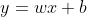
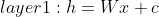
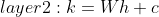
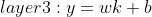

# Understanding neural networks using real examples

A neural network is a computer algorithm inspired
by the human brain, composed of a
network of artificial neurons. This network of
aritificial neurons is able to learn patterns from
example data, and is able to use this learned knowledge to
perform some task.

Despite their consistent
rise in popularity in recent years, neural networks have been
around for quite a while: Frank Rosenblatt laid out
the fundational building blocks for the neural network in
1958. Thats over 60 years ago!

Over the years neural networks were improved, forgotten,
improved, and forgotten again. For years
neural networks couldn't do much, 
because well, computers couldn't do much. With the
enormous rise of computing power however, neural
networks have proven to be invaluable in many many
areas. With this technology becoming ever more
usefull with each year, so does knowledge
on how to build and improve neural networks.

In this example we will learn how a neural network
works by building a neural network that is able to classify
different types of shrubs based on their height and leave
size. We will go through the process of
preprocessing data, defining a neural network architecture,
building a neural network,
and finally training the neural network using our preprocessed
data. Some familiarity with Python 3, Pandas and Keras
will help. 

## Input Data

The most important thing when working with neural networks
is not its architecture: Its the data. Why? You can
build the largest and most complex neural network you want,
one rule always stays the same: Garbage in = Garbage out.
So at the input data we start! 

For this example I generated a dataset
that is located at 

First we take a look at the data to see what we have:

```python
import pandas as pd


df = pd.read_csv('shrub_dataset.csv')

df
"""
     Leave size (cm)  Shrub height (m)     Shrub species name
0           8.232398          3.064781            Hazel Shrub
1           6.374936          1.973804            Hazel Shrub
2           8.961280          3.854265            Hazel Shrub
3           8.242065          2.412739            Hazel Shrub
4           6.736104          2.559504            Hazel Shrub
...
...
97         4.047278          1.403136  Alder Buckthorn Shrub
98         5.911174          2.655614  Alder Buckthorn Shrub
99         4.131060          1.906048  Alder Buckthorn Shrub
"""

df.count()
"""
þLeave size (cm)       100
Shrub height (m)      100
Shrub species name    100
"""

df['Shrub species name'].unique()

"""
array(['Hazel Shrub', 'Alder Buckthorn Shrub'],
      dtype=object)
"""
```

So our dataset has 100 rows, containing Leave size and shrub
height of two different shrub species. The task of the neural network
will be to, given some shrubs leave size, and some shrubs height,
to predict the shrub species. In this example the leave size and shrub height are called the input features, and will be the neural networks input. The shrub species is called the class, and will be the neural networks output.

Note that for all these examples we already know the shrub species. The
reason for this is that our network first needs to learn how different
leave sizes and different shrub heights can lead to different shrub species.
Data in which you already know the class you want to predict is also
called labeled data. It is commonly hard to get alot of labeled data,
because it often involes alot of manual work to create .

Before we can use this to train our network however, there
is some preprocessing we need to do. In itself the network
can only convert numbers to numbers, so we will assign the number 
'0' to the Hazel Shrub and the number '1' to
the Alder Buckthorn Shrub'.

For the input features, note that Leave size is in centimeters,
and shrub height in meters. Another thing we will do is convert all these input values to 0 - 1 range. One of the reasons to do this is to prevent a large feature (such as the shrub height in this case) has a disproportionate effect
on the training. Here is the full preprocessing code:

```python
import pandas as pd

df = pd.read_csv('shrub_dataset.csv')
# Extract the class column from the dataframe
# and conver the class names to numbers.
df_values = df.values
class_column = df_values[:, 2:3]
class_column[class_column == 'Hazel Shrub'] = 0
class_column[class_column == 'Alder Buckthorn Shrub'] = 1

# Drop the class column in the original df
df2 = df.drop(columns=['Shrub species name'])
# Normalise the features in the df
preprocessed_df=(df2-df2.min())/(df2.max()-df2.min())

# Insert the class column again
preprocessed_df.insert(2, 'Shrub species name', class_column)

# Write the preprocessed df to a csv
preprocessed_df.to_csv('preprocessed_shrub_dataset.csv')
```

# Neural Network Architecture

In this example we will be looking at a type
of neural network called a 'Feedforward neural network'.
In Feedforward neural network the data flow is unidirectional:
data comes in at the input, and goes out at the output.

The most fundamental block of a neural network is the artificial
neuron. The artificial neuron is a unit that takes input,
does some mathematical transformation, and produces output.
The mathematical transformation most commonly consists of multiplying the
input value by a weight value, and adding some bias. For example:

 

With $w$ a weight value, and $b$ a bias value. The weight and the bias are the learnable parameters of the
neural network. What this means is that these values change
when the network is learning. Without them our neural network
would not be able to learn anything. When training, the values
of the weights and the bias are adjusted slightly every iteration,
in an attempt to find their optimal values. How this happens
will be discussed later on.

The artificial neurons are organised in layers. We will have 3
artificial neurons in the first layer, a second layer with
3 artificial neurons and a final layer with 1 artificial neuron.
The input is a vector with 2 values: shrub height and leave size.
Sometimes the input is counted as a separate layer, but because
the input is given to the network unmodified, we will not
choose to do so.

From layer to layer, every neuron is connected using weights.
For example, this means that with 2 input values
and 3 neurons in the first layer we will have (2 x 3 )
6 weights in between. From the first to the second layer,
we will have 9 weights (3 * 3), and from the second to the third
layer we will have 3 weights (3 * 1). 
The following is a graphical representation
of our neural network right now: 


Picture


 The following is an
equavalent mathematical representation of the entire neural network: 

 

 

 

Which when chained together forms:

in which %W% are the weight matrixes in the different, %c% is the bias vector


There is still an important ingredient missing from our neural network:
Activation functions. Suppose all that happened in a neural network
with the data from input to output was multiplication with some weights, and addition of some bias. That means that at its best
the neural network would be able to learn a linear function. In other words
 the output of the neural network would always be:

equation


This is where the activation function becomes very important. What
the activation function does is introduce some kind of nonlinearity to the
output. There are many different kinds of activation functions,
but the most common being ReLu. ReLu is often favored over other activation functions because of its simplicity, while still being very powerfull.


figure


Implementing the ReLu function would look like this:


code


Another kind of activiation function is the Sigmoid:


picture


An implemented version of the sigmoid looks like this:


We will add ReLu activation to our hidden layers, and
Sigmoid to our output layer. This is how our final model
will look like:


Equation


We use the Sigmoid as the activation in our final layer because it
forces the output to be in the 0 - 1 range, and given that
we only have 2 output classes, this way the output can be
interpreted as a probability of each class: An output close to 0
means our neural network predicted the shrub to be the Hazel Shrub
and an output close to 1 means our network predicted the shrub to
be the the Alder Buckthorn Shrub.

Now that we have completed our neural network architecture, we can
do a full example run through our neural network, using some dummy
values.


Picture


 
 Fig1. Picture generated with help of http://alexlenail.me/NN-SVG/index.html


The output here does not make much sense yet. This is because the bias
and the weight values were random. The input values used were actually
the first row of our dataset. As you can see the output here should
have been 0, not ... . So it seems our weight and bias values still
need some adjusting. But how should we do this?

# Cost function

The first thing we need when adjusting the weights and the bias values
of our neural network is an algorithm that estimates how wrong
our network is. If we want to update the networks bias and weights,
we need to know how far we are off. This is why we need a cost function.

# Backpropagation


Fig2. Picture generated with help of http://alexlenail.me/NN-SVG/index.html


So in our case this would be


Fig3


Now that we have this number


