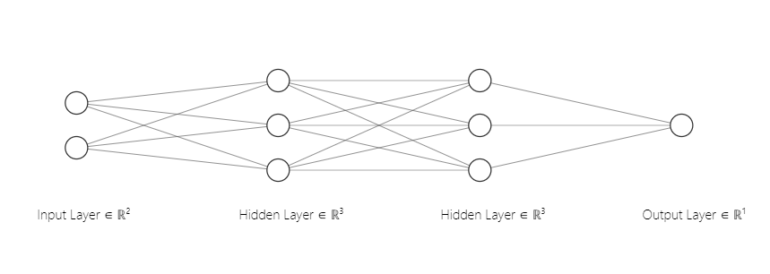
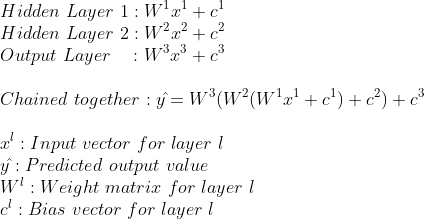

# Neural Network Basics with Python, Pandas and Keras

A neural network is a computer algorithm composed of a
network of artificial neurons. This network of
aritificial neurons is able to learn patterns from
example data, and is able to use this learned knowledge to
perform some task.

Despite their consistent
rise in popularity in recent years, neural networks have been
around for quite a while: Frank Rosenblatt laid out
the fundational building blocks for the neural network in
1958. Thats over 60 years ago!

Over the years neural networks were improved, forgotten,
improved, and forgotten again. For years
neural networks couldn't do much, 
because well, computers couldn't do much. With the
enormous rise of computing power however, neural
networks have proven to be invaluable in many many
areas. With this technology becoming ever more
usefull with each year, so does knowledge
on how to build and improve neural networks.

In this example we will learn how a neural network
works by building a neural network that is able to classify
different types of shrubs based on their height and leave
size. We will go through the process of
preprocessing data, defining a neural network architecture,
building a neural network,
and finally training the neural network using our preprocessed
data. Some familiarity with Python 3, Pandas and linear algebra
will help.

Tutorials on Python and Pandas:
* https://realpython.com/pandas-dataframe/
* https://realpython.com
* https://docs.python.org/3/tutorial/

Tutorials on linear algebra:
* https://www.khanacademy.org/math/linear-algebra
* https://www.mathsisfun.com/algebra/matrix-introduction.html
* https://www.mathsisfun.com/algebra/matrix-multiplying.html

## Input Data

The most important thing when working with neural networks
is not its architecture: Its the data. Why? You can
build most complex neural network,
but one rule always stays the same: **Garbage in = Garbage out**.
So at the input data we start! 

For this example I generated a dataset
that is located at:

https://github.com/akvankorlaar/NeuralNetworkBlog/blob/master/shrub_dataset.csv

First we take a look at the data to see what we have:

```python
import pandas as pd


df = pd.read_csv('shrub_dataset.csv')

df
"""
     Leave size (cm)  Shrub height (m)     Shrub species name
0           8.232398          3.064781            Hazel Shrub
1           6.374936          1.973804            Hazel Shrub
2           8.961280          3.854265            Hazel Shrub
3           8.242065          2.412739            Hazel Shrub
4           6.736104          2.559504            Hazel Shrub
...
...
97         4.047278          1.403136  Alder Buckthorn Shrub
98         5.911174          2.655614  Alder Buckthorn Shrub
99         4.131060          1.906048  Alder Buckthorn Shrub
"""

df.count()
"""
þLeave size (cm)       100
Shrub height (m)      100
Shrub species name    100
"""

df['Shrub species name'].unique()

"""
array(['Hazel Shrub', 'Alder Buckthorn Shrub'],
      dtype=object)
"""
```

So our dataset has 100 rows, containing leave size and shrub
height of two different shrub species. The task of the neural network
will be to, given some shrubs leave size, and some shrubs height,
to predict the shrub species. In this example the leave size and shrub height are the input features, and will be the neural networks input. The shrub species is the target class, and will be the neural networks output. In
our example we will have 2 classes: Hazel Shrub and Alder Buckthorn Shrub.
We only have 2 classes here so the task is called a **binary classifcation**, because our neural network needs to be able to predict
one of these two classes given the input data.

Note that for all these examples we already know the shrub species. Our
goal was to make our neural network predict exactly this, so why do we look
at data where we already know the answer?
The reason for this is that our network first needs to learn how different
leave sizes and different shrub heights can lead to different shrub species.
Data such as this, in which you already know the class you want to predict is
called **labeled data**. Data in which we do not know the class we want to predict is called **unlabeled data**. It is commonly hard to get alot of labeled data, because it often involes manual work to create. In our case
the data is completely generated so luckily thats not the case here. However, suppose this was 'real' data, it means that expert on shrubs had a list of different leave sizes and shrub heights, and manually had to fill in the shrub species. It can take a while to get alot of labeled data that way. 

Before we can use our dataset to train our network, there
is some preprocessing we need to do. In itself the network
can only convert numbers to numbers, so we will assign the number 
'0' to the Hazel Shrub and the number '1' to
the Alder Buckthorn Shrub'.

For the input features, note that Leave size is in centimeters,
and shrub height in meters. Another thing we will do is convert all these input values to 0 - 1 range. One of the reasons to do this is to prevent that a large feature (such as the shrub height in this case) has a disproportionate effect
on the training. Here is the full preprocessing code:

```python
import pandas as pd

df = pd.read_csv('shrub_dataset.csv')
# Extract the class column from the dataframe
# and conver the class names to numbers.
df_values = df.values
class_column = df_values[:, 2:3]
class_column[class_column == 'Hazel Shrub'] = 0
class_column[class_column == 'Alder Buckthorn Shrub'] = 1

# Drop the class column in the original df
df2 = df.drop(columns=['Shrub species name'])
# Normalise the features in the df
preprocessed_df=(df2-df2.min())/(df2.max()-df2.min())

# Insert the class column again
preprocessed_df.insert(2, 'Shrub species name', class_column)

preprocessed_df.columns=['leave_size', 'shrub_height', 'shrub_species']

# Write the preprocessed df to a csv
preprocessed_df.to_csv('preprocessed_shrub_dataset.csv')
```

The following is a visualisation of our preprocessed dataset:

 
Figure 1: Visualisation of reprocessed shrub dataset, with Hazel Shrub (0) in
blue, and Alder Buckthorn Shrub (1) in orange. 

# Neural Network Architecture

In this example we will be looking at a type
of neural network called a **feedforward neural network**.
In a feedforward neural network the data flow is unidirectional:
data comes in at the input, and goes out at the output.

The most fundamental block of a neural network is the **artificial
neuron**. The artificial neuron is a unit that takes input,
does some mathematical transformation, and produces output.
The mathematical transformation most commonly consists of multiplying the
input value by a weight value, and adding some bias. For example:

 

Where w is a **weight** value, and b is a **bias** value. The weights and the bias are the learnable **parameters** of the neural network. Without them our neural network would not be able to learn anything. Recall that we want to classify different types of shrub species based on their leaf size and shrub height. The goal when training a neural network is to create a model that is most likely able to explain the observed data, using these learnable parameters of the neural network. When training, the values
of the weights and the bias are adjusted slightly every iteration,
in an attempt to find their optimal values. How this happens
will be discussed later on. Usually before training the weight
values are initialised at small random values, and the bias values
are initialised at 0.
 
The artificial neurons are organised in layers. We will have 3 types of layers:
* The input layer. The input layer contains the input values without any weight or bias multiplication. In our case this is an input vector with 2 elements (shrub height and leave size).
* The output layer. The output layer is the final layer of our neural network, and outputs the predicted value.
* A hidden layer. Any layer that is not the input layer or the output layer is called a hidden layer. Their outputs are not directly observable.

We can chain these layers together. The number of hidden layers and the number of neurons in each layer is for us to decide. For this example, we will have the input layer, 3 artificial neurons in a first hidden layer, 3 artificial neurons in a second hidden layer and finally the output layer with 1 artificial neuron. From layer to layer, every artificial neuron is connected using weights.
This means that with 2 input elements
and 3 neurons in the first hidden layer we will have (2 x 3 )
6 weights in between. From the first hidden layer to the second hidden layer, we will have 9 weights (3 * 3), and from the second hidden layer to the final layer we will have 3 weights (3 * 1). The number of bias units equals
the number of neurons, so that means in total our neural network will have 25 parameters (6 + 9 + 3 + 7).

The following is a graphical representation
of our neural network (excluding the bias vectors): 

 

 Fig1. Picture generated with help of http://alexlenail.me/NN-SVG/index.html


The following is a mathematical representation of the neural network: 

 

Because we have multiple input values, the input is a vector with 2 elements: the leave size and the shrub height. The weights in
between are aranged as matrixes. For example, the 6 weights in the between the
input layer and the first hidden layer are arranged as a [2x3] matrix (2 input values, 3 neurons in the first hidden layer), and the bias here is a bias vector with 3 elements (because we have 3 neurons in the first hidden layer).

The **depth** of the neural network is the number of layers of the neural
network. In our case the depth of the neural network is 3. This is because the input layer just represents the input data unmodified, as it is, without any weight and bias multiplication, and so it is commonly not counted when calculating the neural networks depth.

There is still an important ingredient missing from our neural network:
an **activation function**. Suppose all that happened in a neural network
with the data from input to output was multiplication of the input vector
with some weight matrixes, and addition of bias some vectors. In this way, the neural network would only be able to learn a linear function.

This is where the activation function becomes very important. What
the activation function does is introduce some kind of nonlinearity to the
output. There are many different kinds of activation functions,
but the most common being the Rectified Linear Unit (ReLu). ReLu is currently
very popular for usage in the hidden layers because of its simplicity, while still being very powerfull. ReLu is easily implemented, and also easily differientable. Why this last point is important will
be discussed later on. The following is an implementation of ReLu:

```python
def ReLu(input):
    if input < 0:
        return 0
    else:
        return input
```

So ReLu always outputs 0 when the input is negative, otherwise it outputs the
unaltered input. We will use ReLu for the first hidden layer, and the second hidden layer.

Another kind of activiation function is the Sigmoid:


picture


An implemented version of the sigmoid looks like this:


We will add ReLu activation to our hidden layers, and
Sigmoid to our output layer. This is how our final model
will look like:


Equation


We use the Sigmoid as the activation in our final layer because it
forces the output to be in the 0 - 1 range, and given that
we only have 2 output classes, this way the output can be
interpreted as a probability of each class: An output close to 0
means our neural network predicted the shrub to be the Hazel Shrub
and an output close to 1 means our network predicted the shrub to
be the the Alder Buckthorn Shrub.

Now that we have completed our neural network architecture, we can
do a full example run through our neural network, using some dummy
values.


Picture


 


The output here does not make much sense yet. This is because the bias
and the weight values were random. The input values used were actually
the first row of our dataset. As you can see the output here should
have been 0, not ... . So it seems our weight and bias values still
need some adjusting. But how should we do this?

# Cost function

The first thing we need when adjusting the weights and the bias values
of our neural network is an algorithm that estimates how wrong
our network is. If we want to update the networks bias and weights,
we need to know how far we are off. This is why we need a cost function.

<a href="http://www.codecogs.com" target="_blank"></a>